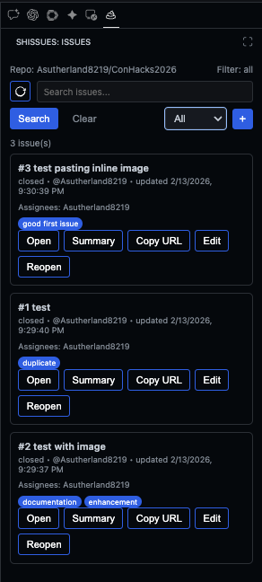
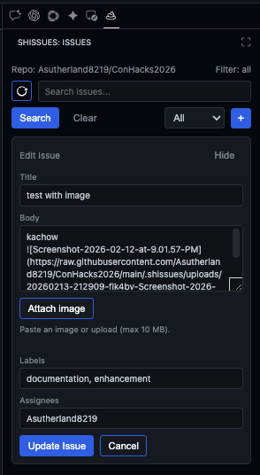
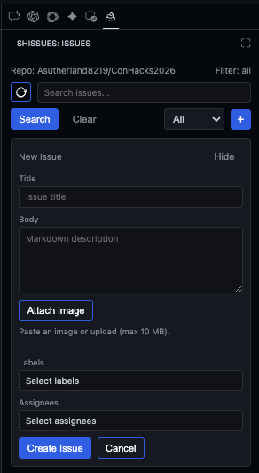

# Shissues

Shissues is a minimal VS Code extension for GitHub issue/PR workflows without leaving the editor.

Current scope:
- List/search issues (read-only).
- Create and edit issues in the sidebar (markdown body, labels, assignees).
- Paste/upload images into issue bodies (stored in repo + inserted as markdown).
- Close/reopen issues from the sidebar.
- Assign existing open issues.
- Create pull requests.
- Read-only API usage for lookups (issues, labels, assignees) except the write operations above.

## Features

- Uses the current workspace `origin` remote by default if it is GitHub.
- Supports explicit repo init/switch via command palette menu.
- Supports both auth styles:
  - VS Code GitHub auth session (`vscode.authentication`)
  - GitHub PAT stored in VS Code SecretStorage
- Includes a status bar menu (`Shissues: <repo>`).
- Includes a sidebar view (Activity Bar -> Shissues -> Issues) with repo selector, search, and issue creation.

## GUI (Sidebar)

The primary workflow is in the Shissues sidebar view:

- Repo label + optional repo selector
- Search box, filter dropdown, and refresh
- Issue list with open/close, copy URL, and edit actions
- Inline issue editor for create/update, labels, assignees, and image upload

## Command Palette Commands

These can be run from the Command Palette (`Cmd+Shift+P` / `Ctrl+Shift+P`):

- `Shissues: Open Menu`
- `Shissues: Init/Change Repo`
- `Shissues: Set Auth Mode`
- `Shissues: Set GitHub PAT`
- `Shissues: Show Required Permissions`
- `Shissues: Refresh Issues View`
- `Shissues: Set Issue Filter`
- `Shissues: Clear Issue Search`
- `Shissues: Create Issue`
- `Shissues: List Issues`
- `Shissues: Search Issues`
- `Shissues: Assign Issue`
- `Shissues: Create Pull Request`

## Config

- `shissues.repo`: `owner/repo` target. If empty, uses detected `origin`.
- `shissues.authMode`: `vscode` or `pat`.
- `shissues.vscodeAuthScopes`: OAuth scopes for VS Code GitHub auth (default: `["repo"]`).
- `shissues.defaultBaseBranch`: default PR base branch (default: `main`).
- `shissues.defaultIssueFilter`: default filter for sidebar view (open/closed/all).
- `shissues.imageUploadPath`: repo path for uploaded issue images (default: `.shissues/uploads`).
- `shissues.imageUploadBranch`: branch to store uploaded images (default: repo default branch).
- `shissues.imageMaxSizeMB`: max image size for uploads/paste (default: `10`).

## Required GitHub permissions

### VS Code GitHub auth provider
- `repo` scope (private + public).
- `public_repo` can be used for public-only repos.

### Fine-grained PAT
Repository permissions:
- Issues: **Read and write**
- Pull requests: **Read and write**
- Contents: **Read and write** (for image uploads)
- Metadata: **Read-only** (implicit in most cases)

### Classic PAT
- `repo` for private repositories.
- `public_repo` for public repositories only.

## Notes

- Repo role permissions still apply (write/triage/maintain/admin as enforced by GitHub).
- Image uploads are stored as files in the repo (under `shissues.imageUploadPath`) and inserted as markdown links.

## Local testing

1. Open this folder in VS Code.
2. Press `F5` (or Run and Debug -> Run Extension) to open an Extension Development Host window.
3. In the new window, open the Activity Bar and click **Shissues** to see the sidebar.
4. Use the built-in search field + **New Issue** button in the sidebar.
5. In the Command Palette, run `Shissues: Open Menu` for full menu actions.
6. Run `Shissues: Init/Change Repo`, then set auth (`Shissues: Set Auth Mode`).
7. Test `Shissues: List Issues`, `Shissues: Search Issues`, and create/assign/PR flows.
